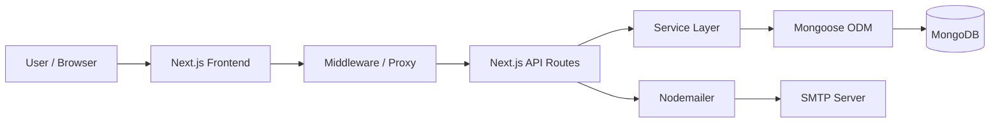
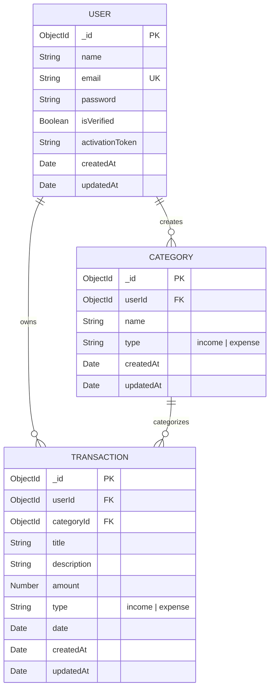
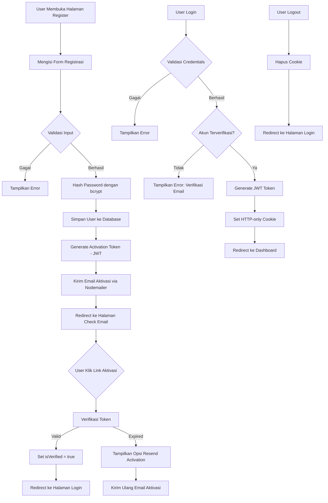
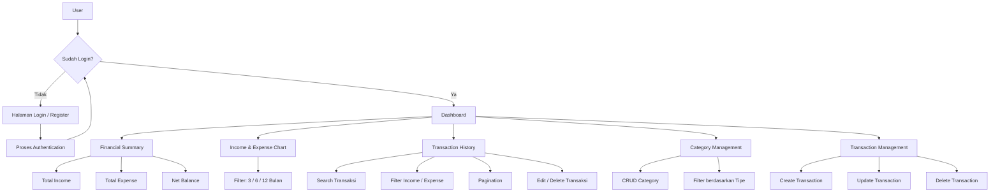

# Personal Finance Tracker

Aplikasi pencatatan keuangan pribadi berbasis web yang dibangun menggunakan Next.js fullstack. Aplikasi ini membantu pengguna mencatat, mengelola, dan memvisualisasikan pemasukan serta pengeluaran mereka secara terorganisir.

**Status:** Minimum Viable Product (MVP)

---

## Daftar Isi

- [Fitur](#fitur)
- [Tech Stack](#tech-stack)
- [Arsitektur Aplikasi](#arsitektur-aplikasi)
- [Struktur Project](#struktur-project)
- [Database Design](#database-design)
- [Database Relationship](#database-relationship)
- [Authentication Flow](#authentication-flow)
- [Application Flow](#application-flow)
- [Dashboard](#dashboard)
- [Transaction Management](#transaction-management)
- [Category Management](#category-management)
- [API Documentation](#api-documentation)
- [Environment Variables](#environment-variables)
- [Instalasi](#instalasi)
- [Available Scripts](#available-scripts)
- [Security](#security)
- [Future Improvements](#future-improvements)
- [Project Status](#project-status)
- [License](#license)

---

## Fitur

### Authentication
- Registrasi akun baru dengan validasi input
- Verifikasi email melalui activation link
- Kirim ulang email aktivasi (resend activation)
- Login dan logout
- JWT authentication dengan HTTP-only cookie
- Route protection menggunakan middleware

### Category Management
- Buat, baca, update, dan hapus kategori
- Kategori dipisahkan berdasarkan tipe: Income dan Expense
- Validasi penghapusan: kategori yang masih digunakan oleh transaksi tidak dapat dihapus
- Pencarian dan filter kategori

### Transaction Management
- Buat, baca, update, dan hapus transaksi
- Pencarian transaksi berdasarkan title dan description
- Filter berdasarkan tipe (Income / Expense)
- Pagination pada daftar transaksi
- Validasi tipe transaksi harus sesuai dengan tipe kategori

### Dashboard
- Ringkasan keuangan: Total Income, Total Expense, dan Balance
- Grafik Income dan Expense per bulan (area chart)
- Filter periode grafik (3, 6, atau 12 bulan terakhir)
- Riwayat transaksi terbaru dengan pagination

### UI/UX
- Dark mode dan light mode (theme switching)
- Skeleton loading untuk indikator pemuatan data
- Responsive design
- Toast notification untuk feedback aksi pengguna
- Dialog/modal untuk form input
- Input validation menggunakan Zod

---

## Tech Stack

### Frontend
| Teknologi | Fungsi |
|---|---|
| Next.js 16 | Framework React fullstack |
| React 19 | Library UI |
| TypeScript | Type safety |
| Tailwind CSS 4 | Utility-first CSS framework |
| shadcn/ui (Radix UI) | Komponen UI |
| React Hook Form | Pengelolaan form |
| Zod | Validasi schema |
| TanStack Query | Data fetching dan caching |
| Axios | HTTP client |
| Recharts | Visualisasi data (chart) |
| Zustand | State management |
| Lucide React | Icon library |
| next-themes | Dark/light mode |
| Sonner | Toast notification |

### Backend
| Teknologi | Fungsi |
|---|---|
| Next.js API Routes | REST API endpoint |
| MongoDB | Database NoSQL |
| Mongoose | ODM (Object Document Mapping) |
| JSON Web Token | Authentication token |
| bcrypt | Password hashing |
| Nodemailer | Pengiriman email |

---

## Arsitektur Aplikasi

Aplikasi ini menggunakan arsitektur fullstack monolith dengan Next.js. Frontend dan backend berada dalam satu codebase. API Routes di Next.js berfungsi sebagai backend yang berkomunikasi langsung dengan MongoDB melalui Mongoose.



---

## Struktur Project

```text
src/
├── app/                    # Next.js App Router
│   ├── (auth)/             # Route group: halaman autentikasi
│   │   ├── check-email/
│   │   ├── login/
│   │   ├── register/
│   │   └── verify-email/
│   ├── (dashboard)/        # Route group: halaman utama
│   │   ├── categories/
│   │   └── dashboard/
│   └── api/                # API Routes (Backend)
│       ├── auth/
│       ├── categories/
│       ├── dashboard/
│       └── transactions/
├── components/             # Komponen React
│   ├── auth/
│   ├── dashboard/
│   ├── shared/
│   └── ui/
├── constants/              # Konstanta aplikasi
├── exceptions/             # Custom error classes
├── hooks/                  # Custom React hooks
│   ├── dashboard/
│   └── transaction/
├── lib/                    # Library dan konfigurasi
│   ├── axios/
│   └── mail/
├── models/                 # Mongoose models
├── providers/              # React context providers
├── services/               # Business logic (backend) dan API service (frontend)
│   └── api/
├── stores/                 # Zustand stores
├── types/                  # TypeScript type definitions
├── utils/                  # Utility functions
└── validations/            # Zod validation schemas
```

---

## Database Design

Aplikasi ini menggunakan **MongoDB** sebagai database dengan **Mongoose** sebagai ODM. Terdapat tiga collection utama: User, Category, dan Transaction.



### Indexes

| Collection | Index | Keterangan |
|---|---|---|
| User | `email` (unique) | Mencegah duplikasi email |
| Category | `userId + name` (unique compound) | Mencegah nama kategori duplikat per user |
| Transaction | `userId + date` (compound) | Optimasi query transaksi berdasarkan tanggal |
| Transaction | `userId + type + date` (compound) | Optimasi query filter berdasarkan tipe |

---

## Database Relationship

- Satu **User** dapat memiliki banyak **Category**.
- Satu **User** dapat memiliki banyak **Transaction**.
- Satu **Category** dapat digunakan oleh banyak **Transaction**.
- Setiap **Transaction** wajib terhubung ke satu **Category** melalui `categoryId`.
- Setiap **Category** dan **Transaction** terikat ke satu **User** melalui `userId`.
- Data antar user terisolasi: setiap operasi CRUD difilter berdasarkan `userId` dari token yang sedang aktif.

---

## Authentication Flow



---

## Application Flow



---

## Dashboard

Dashboard merupakan halaman utama setelah login. Dashboard menampilkan informasi berikut:

### Financial Summary
Tiga kartu ringkasan yang menampilkan:
- **Total Income**: Jumlah seluruh pemasukan dari semua transaksi bertipe income.
- **Total Expense**: Jumlah seluruh pengeluaran dari semua transaksi bertipe expense.
- **Net Balance**: Selisih antara Total Income dan Total Expense.

Summary dihitung menggunakan MongoDB aggregation pipeline yang mengelompokkan transaksi berdasarkan tipe (`income` / `expense`) dan menjumlahkan field `amount`.

### Income & Expense Chart
- Grafik area (area chart) yang menampilkan tren pemasukan dan pengeluaran per bulan.
- Data chart dihasilkan dari aggregation pipeline yang mengelompokkan transaksi berdasarkan tahun, bulan, dan tipe.
- Pengguna dapat memfilter periode chart: **3 bulan**, **6 bulan**, atau **12 bulan** terakhir.
- Format mata uang menggunakan IDR (Rupiah).

### Transaction History
- Tabel riwayat transaksi terbaru dengan kolom: Transaction (title & description), Category, Date, Amount, dan Actions.
- Mendukung pencarian berdasarkan title, filter berdasarkan tipe, dan pagination.

---

## Transaction Management

### Field Transaksi

| Field | Tipe | Keterangan |
|---|---|---|
| title | String | Judul transaksi (wajib) |
| description | String | Deskripsi tambahan (opsional, max 500 karakter) |
| amount | Number | Nominal transaksi (wajib, min 0) |
| type | String | Tipe transaksi: `income` atau `expense` (wajib) |
| categoryId | ObjectId | Referensi ke kategori (wajib) |
| date | Date | Tanggal transaksi (wajib) |

### Operasi yang Tersedia
- **Create**: Membuat transaksi baru. Tipe transaksi harus sesuai dengan tipe kategori yang dipilih.
- **Read**: Menampilkan daftar transaksi dengan dukungan pencarian (title & description), filter (tipe), dan pagination.
- **Update**: Mengubah data transaksi yang sudah ada.
- **Delete**: Menghapus transaksi dengan konfirmasi dialog.

---

## Category Management

### Field Kategori

| Field | Tipe | Keterangan |
|---|---|---|
| name | String | Nama kategori (wajib, unik per user) |
| type | String | Tipe kategori: `income` atau `expense` (wajib) |

### Operasi yang Tersedia
- **Create**: Membuat kategori baru. Nama kategori harus unik per user.
- **Read**: Menampilkan daftar kategori dengan dukungan pencarian, filter tipe, dan pagination.
- **Update**: Mengubah nama atau tipe kategori. Validasi duplikasi nama tetap berlaku.
- **Delete**: Menghapus kategori. Kategori yang masih digunakan oleh transaksi **tidak dapat dihapus** dan akan menampilkan pesan error.

---

## API Documentation

Semua endpoint API berada di bawah prefix `/api`. Endpoint yang memerlukan autentikasi akan membaca JWT token dari HTTP-only cookie.

### Authentication

| Method | Endpoint | Fungsi | Auth |
|---|---|---|---|
| POST | `/api/auth/register` | Registrasi akun baru | Tidak |
| POST | `/api/auth/login` | Login dan mendapatkan token | Tidak |
| POST | `/api/auth/logout` | Logout dan menghapus cookie | Tidak |
| GET | `/api/auth/me` | Mendapatkan profil user saat ini | Ya |
| POST | `/api/auth/verify-email` | Verifikasi email dengan token | Tidak |
| POST | `/api/auth/resend-activation` | Kirim ulang email aktivasi | Tidak |

### Categories

| Method | Endpoint | Fungsi | Auth |
|---|---|---|---|
| GET | `/api/categories` | Mendapatkan daftar kategori | Ya |
| POST | `/api/categories` | Membuat kategori baru | Ya |
| GET | `/api/categories/:id` | Mendapatkan detail kategori | Ya |
| PATCH | `/api/categories/:id` | Mengupdate kategori | Ya |
| DELETE | `/api/categories/:id` | Menghapus kategori | Ya |

### Transactions

| Method | Endpoint | Fungsi | Auth |
|---|---|---|---|
| GET | `/api/transactions` | Mendapatkan daftar transaksi | Ya |
| POST | `/api/transactions` | Membuat transaksi baru | Ya |
| GET | `/api/transactions/:id` | Mendapatkan detail transaksi | Ya |
| PATCH | `/api/transactions/:id` | Mengupdate transaksi | Ya |
| DELETE | `/api/transactions/:id` | Menghapus transaksi | Ya |

### Dashboard

| Method | Endpoint | Fungsi | Auth |
|---|---|---|---|
| GET | `/api/dashboard` | Mendapatkan data dashboard (summary & chart) | Ya |

**Query Parameter Dashboard:**

| Parameter | Tipe | Default | Keterangan |
|---|---|---|---|
| months | Number | 6 | Jumlah bulan terakhir untuk data chart |

---

## Environment Variables

Buat file `.env.local` di root project dan isi dengan variabel berikut:

```env
MONGODB_URI=
MONGODB_DB_NAME=
JWT_SECRET=
JWT_EXPIRES_IN=
EMAIL_SMTP_HOST=
EMAIL_SMTP_PORT=
EMAIL_SMTP_SECURE=
EMAIL_SMTP_USER=
EMAIL_SMTP_PASS=
EMAIL_SMTP_SERVICE_NAME=
APP_URL=
NEXT_PUBLIC_API_URL=
```

| Variabel | Keterangan |
|---|---|
| `MONGODB_URI` | Connection string MongoDB |
| `MONGODB_DB_NAME` | Nama database MongoDB |
| `JWT_SECRET` | Secret key untuk signing JWT token |
| `JWT_EXPIRES_IN` | Masa berlaku JWT token (contoh: `1d`) |
| `EMAIL_SMTP_HOST` | Host SMTP server |
| `EMAIL_SMTP_PORT` | Port SMTP server |
| `EMAIL_SMTP_SECURE` | Gunakan koneksi secure (true/false) |
| `EMAIL_SMTP_USER` | Username/email SMTP |
| `EMAIL_SMTP_PASS` | Password SMTP |
| `EMAIL_SMTP_SERVICE_NAME` | Nama service SMTP |
| `APP_URL` | URL aplikasi (untuk link aktivasi email) |
| `NEXT_PUBLIC_API_URL` | Base URL API untuk frontend |

---

## Instalasi

### Prasyarat
- Node.js (versi 20 atau lebih baru)
- MongoDB (lokal atau cloud seperti MongoDB Atlas)
- Akun SMTP untuk pengiriman email

### Langkah Instalasi

1. Clone repository:
```bash
git clone <repository-url>
cd personal-finance-tracker
```

2. Install dependencies:
```bash
npm install
```

3. Buat file `.env.local` dan isi variabel environment sesuai kebutuhan (lihat bagian [Environment Variables](#environment-variables)).

4. Jalankan development server:
```bash
npm run dev
```

5. Buka browser dan akses `http://localhost:3000`.

---

## Available Scripts

| Script | Perintah | Fungsi |
|---|---|---|
| `dev` | `npm run dev` | Menjalankan development server |
| `build` | `npm run build` | Membuat production build |
| `start` | `npm run start` | Menjalankan production server |
| `lint` | `npm run lint` | Menjalankan ESLint |

---

## Security

Mekanisme keamanan yang diterapkan dalam aplikasi ini:

| Aspek | Implementasi |
|---|---|
| **Password Hashing** | Password di-hash menggunakan bcrypt dengan 10 salt rounds sebelum disimpan ke database. |
| **JWT Authentication** | Token JWT digunakan untuk autentikasi. Token di-generate saat login dan diverifikasi pada setiap request ke endpoint yang dilindungi. |
| **HTTP-only Cookie** | JWT token disimpan dalam HTTP-only cookie dengan flag `secure` (production), `sameSite: lax`, dan masa berlaku 24 jam. Token tidak dapat diakses melalui JavaScript di browser. |
| **Middleware Protection** | Middleware melakukan pengecekan token pada setiap request ke route yang dilindungi (`/dashboard`, `/categories`, `/transactions`). User tanpa token akan di-redirect ke halaman login. |
| **Isolasi Data User** | Setiap operasi CRUD pada category, transaction, dan dashboard difilter berdasarkan `userId` dari token yang aktif. User tidak dapat mengakses data milik user lain. |
| **Input Validation** | Semua input dari user divalidasi menggunakan Zod schema baik di sisi client maupun server. |
| **Environment Variables** | Credential sensitif (database URI, JWT secret, SMTP password) disimpan dalam environment variables dan tidak di-commit ke repository. |

---

## Future Improvements

Fitur-fitur berikut belum tersedia dan merupakan rencana pengembangan di masa depan:

- **Forgot Password & Reset Password** - Memungkinkan user untuk mereset password melalui email.
- **Export Transaction** - Mengekspor data transaksi ke format CSV atau PDF.
- **Budget Management** - Menetapkan batas anggaran per kategori dan mendapatkan notifikasi saat mendekati batas.
- **Recurring Transaction** - Membuat transaksi berulang secara otomatis (harian, mingguan, bulanan).
- **Financial Reports** - Laporan keuangan yang lebih detail dengan grafik dan statistik tambahan.
- **Multi-currency Support** - Mendukung pencatatan transaksi dalam berbagai mata uang.
- **Automated Testing** - Unit test, integration test, dan end-to-end test.
- **Profile Management** - Mengubah nama, email, dan password dari halaman profil.

---

## Project Status

Project ini telah mencapai tahap **Minimum Viable Product (MVP)** dengan fitur-fitur utama yang sudah berfungsi:

- Sistem autentikasi lengkap (register, email verification, login, logout)
- CRUD kategori dengan validasi duplikasi dan proteksi penghapusan
- CRUD transaksi dengan pencarian, filter, dan pagination
- Dashboard dengan ringkasan keuangan dan grafik income/expense
- Skeleton loading untuk pengalaman pengguna yang lebih baik
- Dark mode dan light mode
- Responsive design
- Protected routes dan API endpoints

---

## License

Project ini dibuat untuk keperluan pembelajaran dan portfolio. Tidak ada file license yang disertakan dalam repository ini.
